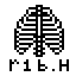

# r1b


*A thermal-printer-oriented, 1 bit graphics renderer for 2D and 3D.*

<br>
<hr>

### [Examples](./examples) / [API Reference](API.md) / [Manual](#manual)

- Header-only C99 library with no dependencies.
- Builtin ESC/POS (printing commands) support.
- Rasterizes 2D and 3D primitives: lines, triangles, ellipses, polygons, meshes...
- Pattern fills: 24 builtin fills + custom designs. All area-filling drawing routines support patterns.
- Bitmap font support: use builtin font or load unifont .hex format, more than 200 other fonts included in the repo.
- Loads .obj 3D models and renders them with wireframes as well as shading.
- Dithers and thresholds images into 1 bit with various algorithms (Floyd-Steinberg, Ordered dithering, Otsu's threshold, Adaptive threshold...)
- Supports multiple pixel-art-upscaling backends: SAA5050, EPX, Eagle, HQX, Bedstead, as well as nearest neighbor and bilinear resampling.
- CV goodies: Sobel & Canny edge detection, Gaussin & box blur, Erosion, Dilation, Convolution.
- Python 3 binding available via SWIG!


## Gallery

Following images are made with r1b and printed with my SKY POS-5870 Thermal Receipt Printer:

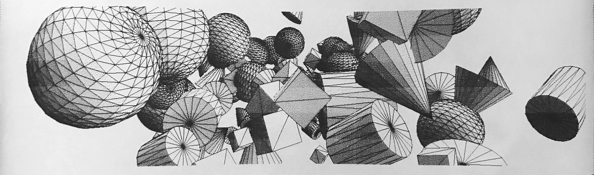
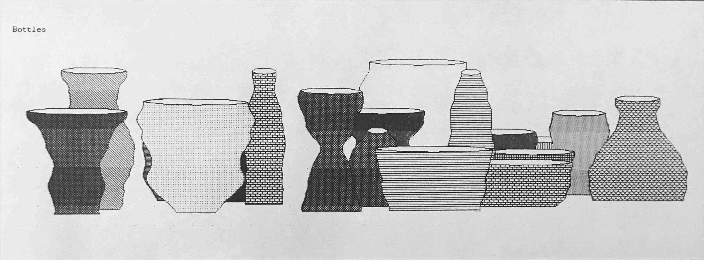
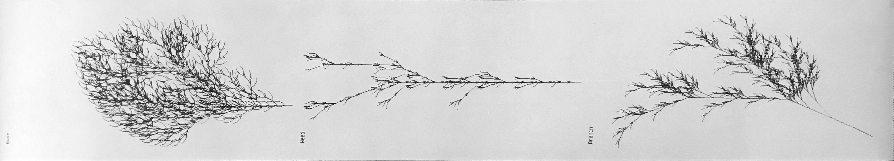
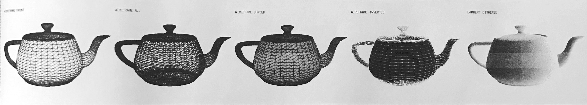
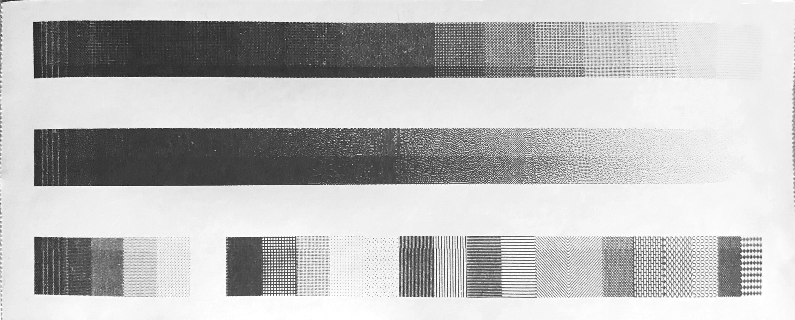


# Manual

## Getting Started

First grab `build/r1b.h` from this repo and put it in your project folder, then:

```c
#include "r1b.h"
```

Done! 


Let's make a simple drawing!

```c
#include "r1b.h"

int main(){
    //initialize a new image of zeros
    r1b_im_t im = r1b_zeros(128,128);
    
    //draw an ellipse
    r1b_ellipse(
        &im,    // pointer to the image
        64,64,  // center coordinate
        40,60,  // radius on each axis
        M_PI/4, // rotation
        R1B_PATTERN(WAVES), // cool pattern fill!
        R1B_BLIT_SET // overwrite the pixels on the image
    );
    
    // save a snapshot of current image to png file
    r1b_snapshot("out.png",&im);
    
    // write a ESC/POS printable document!
    r1b_encode2file("out.bin",&im);
    
    r1b_free(&im); //free up memory
}

```

... and you should be able to see the tiny image in Fig.1:

| Fig. 1  |  Fig. 2 | Fig. 3 | Fig. 4 |
|---|---|---|---|
|   |  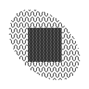  | 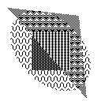  |   |


Note that `build/r1b.h` is the concatenated version which contains the entire source code of [*stbi*](https://github.com/nothings/stb) library for image reading and writing. Alternatively, you can include the more compact `r1b.h` at top-level of this repo. You'll now have two options: To not use stbi at all (and perhaps use your own image library of preference), do:

```c
#R1B_CONFIG_NO_STBI
#include "r1b.h"
```

Or, you can grab a copy of *stbi* from the [original author](https://github.com/nothings/stb), or, from the `external` folder of this repo, and place it in your project folder, then:

```c
#define R1B_CONFIG_STBI_PATH  "path/to/stb_image.h"
#define R1B_CONFIG_STBIW_PATH "path/to/stb_image_write.h"
#include "r1b.h"
```

At this point, you can choose to follow the manual, or simply take a look at the [examples](./examples) and start from there!

## Printing

*If you're using r1b for something other than thermal printers, feel free to skip to the next section.*

r1b offers 3 ways for outputting ESC/POS commands. We've mentioned the first one in the previous section, which is to use `r1b_encode2file` to write to a printable file to disk. Then if you have the printer properly configured with CUPS, you can type the following command in the terminal to print the design (subsituting `Printer_USB_Thermal_Printer` with the name of your printer):

```bash
lpr -PPrinter_USB_Thermal_Printer -o raw out.bin
```

Alternatively, r1b has a function that runs the command above for you from within C code.


```c
r1b_lpr("Printer_USB_Thermal_Printer",&im);
```

The third method returns an array of bytes without writing to file or invoking system commands:

```c
int num_bytes_written;

char* bytes = r1b_encode(&im,&num_bytes_written);

printf("%d bytes written!\n",num_bytes_written);

// printf("%s\n",bytes); // vomit out the (non-human-readable) dump of bytes until first 0

```

### Setting up printer

There're lots of resources on the internet, but here're some quick tips:

- Download the `driver/zj80.ppd` included in this repo. I grabbed it from [here](https://github.com/klirichek/zj-58). Should work for many thermal printer models.
- Install CUPS, goto `localhost:631` and add the driver
- Quick test: `echo "hello world" | lpr -PPrinter_Thermal_Printer -o raw`. Again, subsitute with the name of your printer.


## Basic Shapes and Patterns

### Shapes

We saw how to draw an ellipse in the last section, let's do a rectangle (Fig. 2):

```c

// draw a rectangle
r1b_rect(&im,
    40,  40,  // upper left corner
    88,  88,  // lower right corner
    R1B_PATTERN(GRAY4), // a different pattern fill
    R1B_BLIT_SET
);
    

```

Let's draw a triangle on top of it, but instead of overwriting the pixels, we also can flip the pixels so we can see through the shape behind (Fig. 3):

```c
// draw a triangle
r1b_triangle(&im,
    10,  10,  // first vertex
    110,125,  // second vertex
    100, 20,  // third vertex
    R1B_PATTERN(GRAY3),
    R1B_BLIT_FLIP   // <-- flip the pixels!
);

```

As you can see the flip mode creates some pretty interesting new patterns!

For most of the operations, you'll be able to set the blit flag for different compositing methods, available options are:

- `R1B_BLIT_SET`:  overwrite the pixel;
- `R1B_BLIT_FLIP`: flip the value of the pixel;
- `R1B_BLIT_OR`:   turn on the pixel if it's off;
- `R1B_BLIT_ADD`:  add the value to the original.

Lines (Fig. 4):

```c
// perfect 1 pixel line
r1b_line(&im,
    28, 28,  // first endpoint
    100,100, // second endpoint
    1,       // color
    R1B_BLIT_SET
);

// a bolder line
r1b_thick_line(&im,
    100, 28, // first endpoint
    28, 100, // second endpoint
    1,       // color
    2,       // that much thicker on either side of the line
    R1B_BLIT_SET
);

```

Note that as a thermal-printer-oriented library, r1b uses 1.0 as the color for "on" pixels and 0.0 for "off" pixels. An "on" pixel corresponds to where a thermal printer need to burn a dot, and hence looks black when printed. This is the inverse of how we view colors on screen, where a pixel with higher value is rendered brighter. The `r1b_snapshot` function takes this into account, and flips the values when writing to an image file like PNG, so that the output simulates what we'll see when we actually print the image.

All the image processing routines in r1b follows the semantic meaning of 0 and 1 as "off" and "on", in instead of the black and white colors that they're sometimes associated with. Therefore, dilation will still produce more 1-pixels as usual, making the black lines appear thicker when printed.

### Builtin patterns

We'll go into more complex shapes in the next section, but first let's check out all the pattern fills. There're 24 builtin patterns, all implemented as C macros. Let's draw them as a "color card" for future reference.


```c
r1b_im_t* get_nth_pattern(n){
  // access each builtin pattern by index
  switch (n) {
    case  0: return R1B_PATTERN(SOLID);
    case  1: return R1B_PATTERN(GRAY5);
    case  2: return R1B_PATTERN(GRAY4);
    case  3: return R1B_PATTERN(GRAY3);
    case  4: return R1B_PATTERN(GRAY2);
    case  5: return R1B_PATTERN(GRAY1);
    case  6: return R1B_PATTERN(EMPTY);
    case  7: return R1B_PATTERN(GRID1);
    case  8: return R1B_PATTERN(GRID2);
    case  9: return R1B_PATTERN(DOTS1);
    case 10: return R1B_PATTERN(DOTS2);
    case 11: return R1B_PATTERN(DOTSR);
    case 12: return R1B_PATTERN(HRZL1);
    case 13: return R1B_PATTERN(HRZL2);
    case 14: return R1B_PATTERN(VRTL1);
    case 15: return R1B_PATTERN(VRTL2);
    case 16: return R1B_PATTERN(DGNLL);
    case 17: return R1B_PATTERN(DGNLR);
    case 18: return R1B_PATTERN(CROSS);
    case 19: return R1B_PATTERN(BRICK);
    case 20: return R1B_PATTERN(SCALE);
    case 21: return R1B_PATTERN(WAVES);
    case 22: return R1B_PATTERN(CHESS);
    case 23: return R1B_PATTERN(DMOND);
  }
  return NULL;
}
int main(){
    r1b_im_t im = r1b_zeros(1200,100);
    
    for (int i = 0; i < 24; i++){
        r1b_im_t* pttn = get_nth_pattern(i);
        // draw a rect for each pattern
        r1b_rect(&im,
                i*50, 0,      // upper left corner
            (i+1)*50, im.h,   // lower right corner
            pttn, R1B_BLIT_SET);
    }
    
    r1b_snapshot("out.png",&im);
    
    r1b_transpose_flip(&im); // rotate image by 90° so the dimensions fit into the printer
    r1b_encode2file("out.bin",&im);
    
}
```


Fig. 5

Note that the pattern names (e.g. `SOLID`, `GRAY5` etc.) does not pollute the global namespace, they're used as verbatim strings in the macro and does not have meaning elsewhere. (Look into the source code for `R1B_PATTERN()` and see the magic!)


### Custom Patterns

In fact, patterns are also just an image type, so we can create our own quite easily.


```c
// data for a 4x4 "L" shaped pattern.
float pattern_data[16] = {
    0,1,0,0,
    0,1,0,0,
    0,1,1,1,
    0,0,0,0,
};

r1b_im_t pttn = r1b_from_array(
    4, //width
    4, //height
    pattern_data //data array
);

``` 

r1b uses 1-channel row-major floating point arrays for storing all image data, we'll go into more of that later.

Use it to draw the ellipse in the first demo (Fig. 6):

```c
r1b_ellipse(&im, 64,64,40,60,M_PI/4, 
    &pttn, // <-- pointer to our pattern!
    R1B_BLIT_SET);

```

| Fig. 6  |  Fig. 7 | Fig. 8 | Fig. 9 |
|---|---|---|---|
|  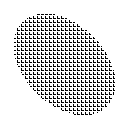 |  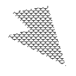  | 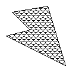  | 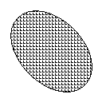  |

## More shapes

We can drawn an arbitrary polygon defined by arrays of coordinates. (Fig. 7)

```c
float X[] = {50, 80, 110, 10, 50, 20}; // x coordinates
float Y[] = {15, 10, 110, 60, 50, 20}; // y coordinates

r1b_polygon(&im,
    X,Y, // vertices
    6,   // number of vertices
    R1B_PATTERN(SCALE), R1B_BLIT_SET,
    R1B_POLY_CONCAVE // we're drawing a concave polygon
);
``` 

The `R1B_POLY_CONVEX` mode can be passed in place of `R1B_POLY_CONCAVE` if we're sure that our polygon is convex for a speed up; otherwise `R1B_POLY_CANCAVE` works for both situations.

We can draw an outline for the polygon as a polyline with `r1b_lines` (Fig. 8):

```c
r1b_lines(&im,
    X,Y, // vertices
    6,   // number of vertices
    1,   // closed? closed -> polygon, open -> polyline
    1,   // color
    R1B_BLIT_SET
);
```


We can also draw outline for our previous ellipse with `r1b_line_ellipse` (Fig. 9):

```c
r1b_line_ellipse(
    &im,    // pointer to the image
    64,64,  // center coordinate
    40,60,  // radius on each axis
    M_PI/4, // rotation
    32,     // detail, number of segments used to approximate the ellipse
    1,      // color
    R1B_BLIT_SET // overwrite the pixels on the image
);
```

## Images and the Image Struct

Here's how to read images from disk, resize them (so it fits in the thermal printer) and dither them to 1 bit (Fig. 10):

```c
// read from disk as grayscale
r1b_im_t im = r1b_read("examples/assets/peppers.png");

// `w` and `h` fields store the dimensions
printf("width=%d height=%d\n",im.w,im.h);

// resize the image
r1b_resample(
    &im,       // pointer to image
    128,       // width
    R1B_INFER, // height, we can use R1B_INFER to
               // scale proportionally based on given width
    R1B_SMPL_BILINEAR  // resampling method
                       // use R1B_SMPL_NN for nearest neighbor
);

// dither with Floyd-Steinberg algorithm
r1b_dither(&im, R1B_DTHR_FS);

// we can also use ordered dithering for a more "retro" look
// r1b_dither(&im, R1B_DTHR_ORD);

// `im` is now dithered. save the output!
r1b_snapshot("out.png",&im);

```

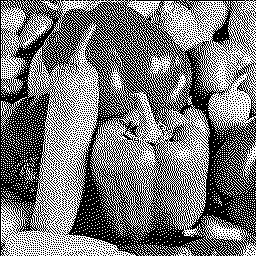

Fig. 10


In r1b, all images are internally stored as 1-channel row-major floating point array. Though r1b claims to be a library for 1-bit graphics, it is often necessary to operate on grayscale images before binarizing it to 1-bit using thresholding or dithering. Thefore, to avoid the inconvenience and inefficiency of constantly converting between types, we store even binary images as floating points, typically using 0.0 and 1.0 to mean on and off. This also makes it possible to abuse r1b as grayscale or even full RGB or RGBA processing. Most of the operations do not assume propeties of the pixels stored and merely copy the value around. So with a bit of bit-twiddling we can reinterpret the 32-bits of the float for anything, e.g. a hex color 0xAARRGGBB.

Here's a short list of basic operations for images:

```c
r1b_zeros(width,height); // image of all 1's 
r1b_ones(width,height);  // image of all 1's 
r1b_infs(width,height);  // image of infinities, useful for depth buffer

r1b_im_t dst = r1b_copy_of(&src); // duplicate an image
r1b_copy_to(&src,&dst); // src and dst should be the same size
r1b_normalize(&im,0.0,1.0); // normalize image to given range
r1b_transpose(&im);
r1b_transpose_flip(&im); // effectively rotating image by 90°
                         // useful for fitting a fat image to the printer
r1b_log(&im);    // print image to stdout for debugging
```

All operations on images are in-place, including drawing routines, image processing etc. Internally, some operations are inherently in-place while some are not, however we unify to make all of them appear in place to the user for consistency and convenience (typically we need a series of operations for one specific effect). To support this efficiently, r1b has 2 internal buffers for inherently non in-place operations, and upon returning, it either does a `memcpy` or simply swap out the data pointer, so in fact there's minimum memory allocation/freeing happening behind the scene. 

You can keep a copy of the original image using `r1b_copy_of()` and use `r1b_cleanup()` to free these internal buffers if you're in dire need of memory.

We'll see more advanced image processing tricks in future sections.

### Accessing image data

There're two ways to access image data. One way is directly through the `data` field, e.g.:

```c
// get
float val = im.data[y * im.w + x];

// set
im.data[y * im.w + x] = 0.5;
```

There's also functions `r1b_get()` and `r1b_set()` that help with things like boundry checking and blit modes:

```c
float val = r1b_get(&im, x, y, 
   R1B_BRDR_ZERO  // when coordinate is out of range, return 0. the options are:
                  // R1B_BRDR_ZERO: zero padded
                  // R1B_BRDR_COPY: copy padded
                  // R1B_BRDR_WRAP: wrap around
                  // R1B_BRDR_NONE: no boundry checking
);

r1b_set(&im, x, y, val, 
    R1B_BLIT_SET // see previous section for a list of blit modes
);

```


## Font and Text

r1b supports the rendering of bitmap fonts. It has a default font burnt into the code that is always available, and you can also load more custom fonts with unifont `.hex` format.

The builtin font is accessible through `R1B_FONT_FG8X12` which is based on the [freeglut 8x13 bitmap font](ftp://146.255.57.4/nongnu/construo/doxygen/freeglut__font__data_8c-source.html). Here's an example:

```c
r1b_text(&im,
    L"Hello World!", // the string!
    10,10, // upper left corner
    R1B_FONT_FG8X12, // pointer to font
    1, // color
    R1B_BLIT_SET,
    0 // highlight: use 1 for standing out from busy background
);

```

Wide chars strings (`wchar_t*`) are used by `r1b_text` to support unicode. Alternatively, you can use `r1b_text_ascii()` to draw exclusively ASCII characters, or `r1b_text_utf8()` to draw a utf-8 encoded string. They have an identical signature.

We can also load `.hex` fonts from the disk. For example, unifont is an awesome bitmap font that supports most of the glyphs in unicode:

```c
r1b_font_t font = r1b_load_font_hex(
    "fonts/unifont.hex", // path to the font file
    16,     // height of the font. 
            // this must be the correct height of the bitmap font
            // unless you're looking for funny results
    0,      // lowest of the code point range to load
    INT_MAX,// highest of the code point range to load
    R1B_FLAG_SORTED  // font is sorted by unicode code point
);
```

if we don't need the whole unifont (or want to save space), we can load only a range of it using the third and fourth arguments. In the above example we used `(0,INT_MAX)` for the full range. Anyways, let's draw some unicode!

```c
r1b_text(&im,
    L"問天地好在", // the unicode string!
    10,10, // upper left corner
    &font, // pointer to font
    1, // color
    R1B_BLIT_SET,
    0 // highlight: use 1 for standing out from busy background
);
```

| Fig. 11 |
|---|
| 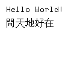 |


To free memory allocated in the font:

```c
r1b_destroy_font(&font);
```

There are about 200 aditional bitmap fonts included in the `font` folder of this repo for your convenience. Most of them are converted from BDF format downloaded from [https://github.com/Tecate/bitmap-fonts](https://github.com/Tecate/bitmap-fonts). Beware that they might have different license from the r1b library itself. e.g. Unifont is GNU licensed.


## 3D

r1b contains a low-level minimalistic 3D engine. It is capable of rendering triangle meshes with and without wireframe, with flat shading (pattern fill) and lambertian shading (dither). The perspective camera is fixed at (0,0,0) with adjustable focal length. There're a set of builtin primitives such as 3d triangles, 3d lines, cubes, spheres, cylinders and cones, and the user can acquire more by either loading a model file in wavefront .obj format, or procedurally generate one. Many transformation matrix utilities such as rotation, translation, scaling are also provided for convenience. 

Let's start with a sphere with flat shading (Fig. 12):

```c
r1b_im_t im = r1b_zeros(384,384); // the image to render onto
r1b_im_t depth = r1b_infs(384,384); // the depth buffer
float focal = 1000;  // focal length of the camera

// generate a sphere mesh
r1b_mesh_t mesh = r1b_sphere(
    0.5, //radius
    20,  //slices, # of longitudes
    20   //stacks, # of latitudes
);

// position the mesh at a good place for rendering
r1b_scale_rotate_translate(&mesh, 
  1,  1,1,  //scale
 -0.5,0,0,  //rotation (euler angles)
  0,  0,4   //we need a z-offset because camera is at (0,0,0)
);
    
r1b_render_mesh(&im, &depth, &mesh, focal, 
    R1B_PATTERN(GRAY2), // pattern fill 
    NULL, // light source, since we're doing flat shading, we're passing NULL 
    1,    // color of wireframe
    R1B_SHDR_FLAT,  // tell r1b to use the flat shader 
    R1B_WIRE_FRONT  // draw visible wireframes only, 
                    // use R1B_WIRE_NONE for no wireframe, or
                    // R1B_WIRE_ALL to include back ones
);

r1b_snapshot("out.png",&im);

r1b_destroy_mesh(&mesh); // free up memory

```

| Fig. 12  |  Fig. 13 | Fig. 14 |
|---|---|---|
|  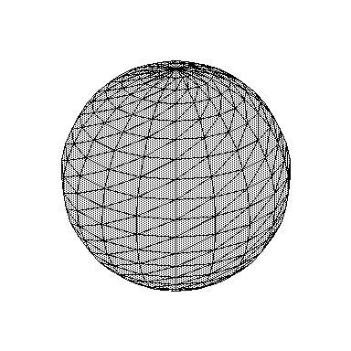 |  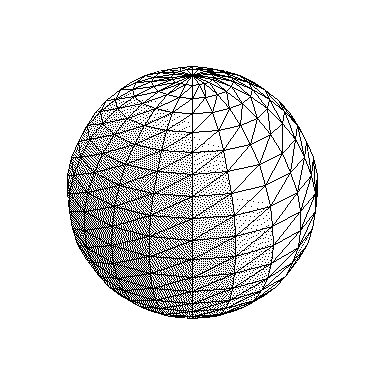  | 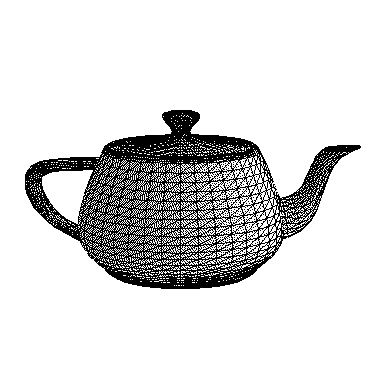  | 

We can add some "realism" by using a lambertian shader instead (Fig. 13):

```c
// directional light
float light[4] = {
    0.4, 0.3, 0.2, //xyz direction
    0.0 //global illumination
};
r1b_render_mesh(&im, &depth, &mesh, focal, 
    NULL,  // we're not using pattern for lambertian shader, so pass NULL for pattern
    light, // the light
    1,     // color of wireframe
    R1B_SHDR_NDOTLF,  // n-dot-l (lambertian) shading, floating point (non-quantized) output
    R1B_WIRE_FRONT    // draw visible wireframes only
);
// we need to dither the image, because the `R1B_SHDR_NDOTLF` gives a grayscale output
r1b_dither(&im, R1B_DTHR_FS);

```

The `r1b_scale_rotate_translate` function we saw earlier is a convenient wrapper for transformation matrices. we can also transform the mesh directly with the latter:

```c
float rotx = -0.2;
float movz = 5;
float mat[] = {
        1,        0,         0,   0,
        0,cos(rotx),-sin(rotx),   0,
        0,sin(rotx), cos(rotx),movz,
        0,        0,         0,   1,
}
r1b_transform_mesh(&mesh, mat);

```

or use some r1b macros for matrix math:

```c
float rot[] = R1B_MAT_ROTX(-0.2);  
float trl[] = R1B_MAT_TRSL(0,0,5);
float tfm[] = R1B_MAT_MULT(trl,rot);

r1b_transform_mesh(&mesh, tfm);
```

Here's a list of other 3d primitives that come with r1b:

```c
r1b_mesh_t cube    = r1b_cube(1,1,1);           // width, height, depth
r1b_mesh_t sphere  = r1b_sphere(0.5,20,20);     // radius, slices, stacks
r1b_mesh_t cylinder= r1b_cylinder(0.5,0.5,1,20);// radius-x, radius-z, height, slices
r1b_mesh_t cone    = r1b_cone(0.5,0.5,1,20);    // radius-x, radius-z, height, slices

```

In addition to primitives, we can also load .OBJ files to a mesh (Fig. 14):


```c
// load the classic teapot
r1b_mesh_t mesh = r1b_load_obj("examples/assets/teapot.obj");

// resize mesh so it stays within (-1,-1,-1) and (1,1,1)
r1b_normalize_mesh(&mesh);

r1b_scale_rotate_translate(&mesh, 1,1,1, -0.2,0,0, 0,0,6); 

// optional: generate vertex normals for smoother shading effects
// might cause problems with certain meshes
r1b_compute_vertex_normals(&mesh);

float light[4] = {0.3,0,0.3,0.1};
r1b_render_mesh(&im, &depth, &mesh, 1000, NULL, light, 1, R1B_SHDR_NDOTLF, R1B_WIRE_FRONT);

r1b_dither(&im,R1B_DTHR_FS);
```

Procedural meshes are easy to do too. Let's try making a simple quad:


```c
r1b_mesh_t mesh;

// malloc the vertices: there're 4 of them
mesh.X = (float*)malloc(sizeof(float)*4);
mesh.Y = (float*)malloc(sizeof(float)*4);
mesh.Z = (float*)malloc(sizeof(float)*4);

// two triangles, each with 3 indices
mesh.tris = (int*)malloc(sizeof(int)*2*3);

mesh.norms = NULL; // we don't need vertex normals

// we'll first set the number of triangles and vertices to 0
// the macros R1B_MESH_ADD_VTX and R1B_MESH_ADD_TRI will 
// increment these automatically for us
mesh.n_tri = 0;
mesh.n_vtx = 0;

// quad vertices
// (in 3d mode, positive y axis point upwards)
R1B_MESH_ADD_VTX(mesh,-1, 1,0); // upper left
R1B_MESH_ADD_VTX(mesh, 1, 1,0); // upper right
R1B_MESH_ADD_VTX(mesh,-1,-1,0); // lower left
R1B_MESH_ADD_VTX(mesh, 1,-1,0); // lower right

// triangles (clockwise winding)
R1B_MESH_ADD_TRI(mesh, 0, 1, 2);
R1B_MESH_ADD_TRI(mesh, 1, 3, 2);

printf("# vertices = %d, #triangles = %d\n",mesh.n_vtx,mesh.n_tri);

```

Currently r1b doesn't support UV and textures.

## Image Processing

r1b provides basic image processing tools such as edge finding, erosion/dilation, threholding and bluring:

```c
// blurring
r1b_blur(
    &im, // pointer to image
    5,   // radius (half kernel size)
    R1B_BLUR_GAUSS // mode, gaussian or box (R1B_BLUR_BOX)
);

// sobel edge detection
r1b_sobel(
    &im,  // pointer to image
    NULL, // if we want gradient directions, 
          // we can pass a pointer to array of floats here to be overwritten
);

// canny edge detection
r1b_canny(
    &im, // pointer to image
    5,   // blur radius
    0.1, // weak edge threshold
    0.2, // strong edge threshold
);

// make a morphologic kernel for dilation
r1b_im_t kern = r1b_make_kernel(
    5,  // kernel size
    R1B_KERN_ELLIPSE // also available: R1B_KERN_CROSS, R1B_KERN_RECT
);
// dilation (more 1's)
r1b_dilate(&im,&kern);

// or erosion (more 0's)
r1b_erode(&im,&kern);

// thresholding
r1b_threshold(&im, 
    R1B_INFER // use Otsu's method to estimate best threshold,
              // or, put in a float for fixed threshold, e.g. 0.5
);

```

You can also define your own kernels for convolution, as kernels are image types too.

```c
// data for separable kernels
float* data = {0.1,0.2,0.4,0.2,0.1};

// horizontal pass
r1b_im_t my_blur_x = r1b_from_array(5,1,data);

// vertical pass
r1b_im_t my_blur_y = r1b_from_array(1,5,data);

r1b_conv2d(&im, &my_blur_x, R1B_BRDR_COPY); // 2d convolution, copy padded
r1b_conv2d(&im, &my_blur_y, R1B_BRDR_COPY);

```


### Pixel-art Upscaling

While `r1b_resample()` can generally be used to upscale drawings, sometimes we need a more delicate algorithm to upscale tiny pixel art or bitmap fonts for better effects. r1b comes with several 2x pixel art upsampling algorithms (some of which can be applied repeatedly to upscale to more than 2x), as well as the [bedstead algorithm](https://bjh21.me.uk/bedstead/) which allows scaling to any power of 2 in one step.

```c
r1b_upsample2x(&im,
	R1B_UP2X_EPX, // the algorithm. choices are:
					// R1B_UP2X_SAA5050,
					// R1B_UP2X_EAGLE,
					// R1B_UP2X_HQX
);
```

Bedstead is great at upscaling fonts.

```c
r1b_im_t im = r1b_zeros(64,12);
r1b_text(&im, L"sometext", 0,0, R1B_FONT_FG8X12, 1, R1B_BLIT_SET, 0);

r1b_beadstead(&im, 
	3 //nth power of 2, 2^3 = 8x
);
```
