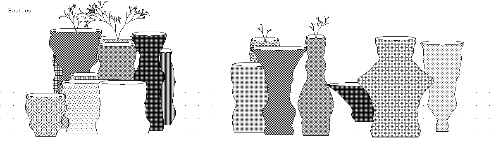
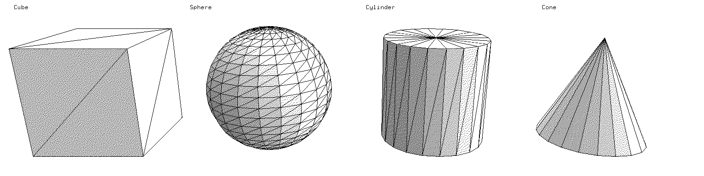
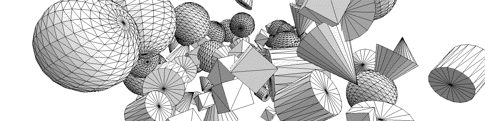
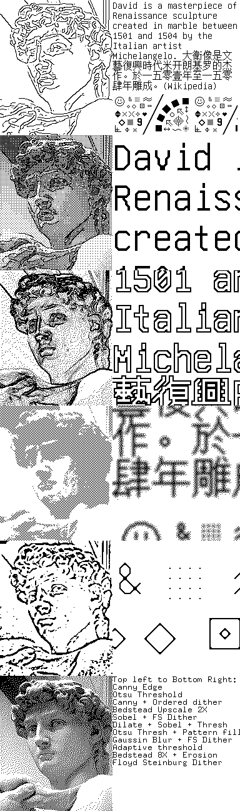
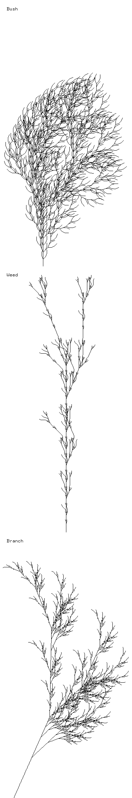
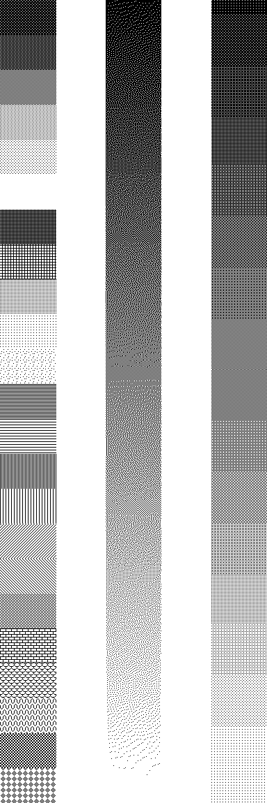
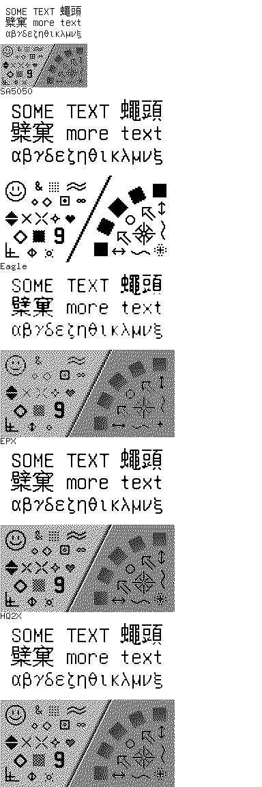
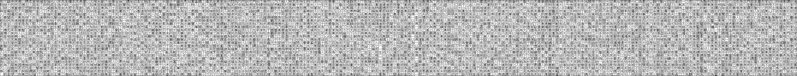
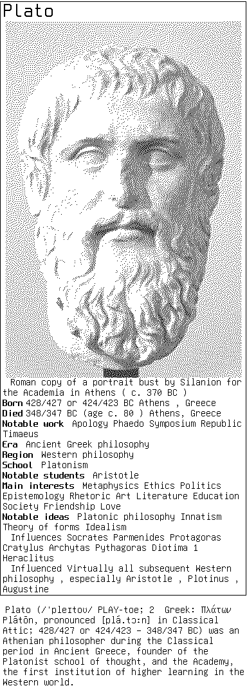

# r1b Examples

Here lives examples that help demonstrate r1b features.

## Table of Contents
- [C99 examples](#c)
- [Python examples](#python)
- [Utils](#utils)

## C

### [bottles.c](bottles.c)

Generate bottles of random shapes and patterns.

------------------------

### [prim.c](prim.c)

Render builtin primitives

------------------------

### [prim2.c](prim2.c)

Render builtin primitives with random composition

------------------------

### [mesh.c](mesh.c)

Render an OBJ file with different wireframes and shadings.

------------------------

### [filters.c](filters.c)

Showcase various filter effects and CV algorithms

------------------------

### [plants.c](plants.c)

Draw some L-Systems with turtle graphics

------------------------

### [fonts.c](fonts.c)

Render/test all fonts included in the repo

------------------------

### [colorcard.c](colorcard.c)

Showcase patterns and ditherings

------------------------

### [upsample.c](upsample.c)

Showcase pixel art upsample algorithms

------------------------

### [scroll.c](scroll.c)

Render a long scroll of Chinese text

------------------------

## Python

### [mesh.py](py/mesh.py)

Python version of mesh.c

------------------------

### [wiki.py](py/wiki.py)

Pull wikipedia pages about historical figures and print the intro card.

## Utils

Handy utilities that are not officially part of r1b lives in the `examples/utils` folder.

### [utils/random.h](utils/random.h)

Perlin noise and Gaussian randomness

### [utils/lsys.h](utils/lsys.h)

Defining and stepping L-Systems

### [utils/turtle.h](utils/turtle.h)

Turtle graphics with r1b
